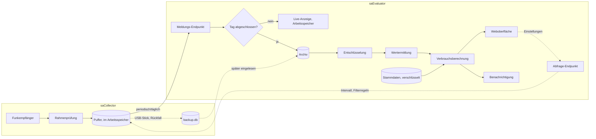
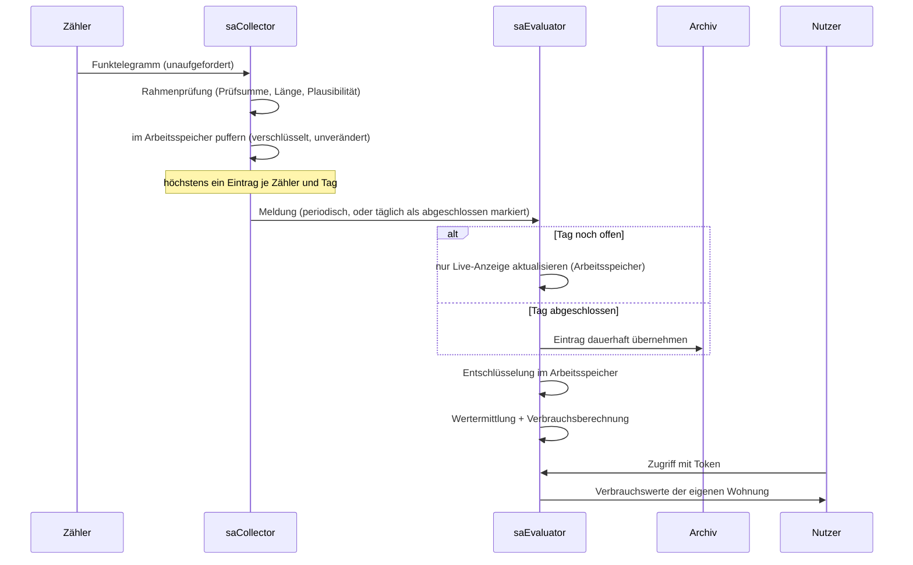

# Architektur

Dieses Dokument beschreibt den technischen Aufbau von **selbst-ableser**: Empfang,
Archivierung und Auswertung von Funk-Zählerständen (Wärme-, Warmwasser- und
Kaltwasserzähler) für eine monatliche Verbrauchsinformation an Mieter, ohne Cloud-Anbindung
und ohne Weitergabe von Rohdaten an Dritte.

## Inhaltsübersicht

1. [Grundbegriffe](#grundbegriffe)
2. [Komponentenübersicht](#komponentenübersicht)
3. [Datenklassen und Sicherheitsmodell](#datenklassen-und-sicherheitsmodell)
4. [Datenfluss](#datenfluss)
5. [Speicherung](#speicherung)
6. [Funkprotokoll-Verarbeitung](#funkprotokoll-verarbeitung)
7. [Stammdaten](#stammdaten)
8. [Verbrauchsberechnung](#verbrauchsberechnung)
9. [Zugriffskontrolle](#zugriffskontrolle)
10. [Weboberfläche](#weboberfläche)
11. [Benachrichtigungen](#benachrichtigungen)
12. [Betrieb](#betrieb)
13. [Betriebsformen](#betriebsformen)
14. [Technologie-Stack](#technologie-stack)
15. [Code-Struktur](#code-struktur)
16. [Nicht-Ziele](#nicht-ziele)

---

## Grundbegriffe

| Begriff | Bedeutung |
|---|---|
| wM-Bus | Wireless M-Bus, Funkprotokoll für Verbrauchszähler (EN 13757-4), 868,95 MHz |
| OMS | Open Metering System — Profil auf wM-Bus, u. a. für Verschlüsselung |
| Telegramm | Eine Funknachricht eines Zählers (Kopf + Nutzdaten) |
| HKV | Heizkostenverteiler — misst dimensionslose Einheiten proportional zur Wärmeabgabe |
| WWZ / KWZ | Warmwasser- bzw. Kaltwasserzähler — messen Volumen |
| Zählerplatz | Physische, dauerhafte Messstelle (z. B. „Heizkörper Wohnzimmer, Wohnung 3") |
| Zähler | Das an einem Zählerplatz montierte, austauschbare Gerät |
| Stichtag | Ende der Abrechnungsperiode; HKV setzen zu diesem Datum auf null zurück |
| kc-Faktor | Bewertungsfaktor eines HKV, rechnet Anzeigeeinheiten auf tatsächliche Wärmeabgabe um |
| UVI | Unterjährige Verbrauchsinformation — die monatliche Mitteilung an den Nutzer |
| Snapshot | Tägliche Momentaufnahme aller zuletzt empfangenen Telegramme |
| Collector | Komponente, die Funktelegramme empfängt und archiviert |
| Evaluator | Komponente, die das Archiv entschlüsselt, auswertet und Zugriff gewährt |

## Komponentenübersicht

Das System besteht aus zwei eigenständigen Programmen (jeweils ein eigenes Go-Modul, siehe
[Code-Struktur](#code-struktur)), die ausschließlich über eine authentifizierte
Netzwerkschnittstelle gekoppelt sind — kein gemeinsamer Dateizugriff, keine gemeinsame
Datenbank:



- **saCollector** empfängt Funktelegramme, prüft sie auf Rahmenebene und hält den letzten
  Stand je Zähler im Arbeitsspeicher. Er besitzt keinerlei Schlüsselmaterial und keine
  Zugangsdaten — das ist keine Konfigurationsoption, sondern strukturell erzwungen: Er lebt
  in einem eigenen Go-Modul, das die Module des Evaluators (und damit `crypto`,
  `masterdata`, `billing`, `access`) gar nicht importieren *kann* — Gos eigene
  Sichtbarkeitsregel für `internal/`-Pakete verhindert das auf Compiler-Ebene, nicht nur per
  Konvention.
- **saEvaluator** nimmt Meldungen von einem oder mehreren Collectors entgegen, entscheidet
  je Eintrag anhand von dessen Tag, ob er nur die Live-Anzeige speist oder zusätzlich
  dauerhaft ins Archiv übernommen wird, entschlüsselt Telegramme ausschließlich im
  Arbeitsspeicher, berechnet Verbräuche anhand der Stammdaten und stellt Ergebnisse über
  eine Weboberfläche bereit — über die auch die Betriebsparameter jedes Collectors
  verwaltet werden (siehe [Betriebsformen](#betriebsformen)).

Beide laufen typischerweise auf derselben Maschine (kleine Anlage) oder auf getrennten
Geräten (räumlich getrennte Empfänger); der einzige Unterschied ist, welche Adresse und
welches Geheimnis ein Collector beim Start mitbekommt.

## Datenklassen und Sicherheitsmodell

Der gesamte Entwurf richtet sich nach der Schutzbedürftigkeit der verarbeiteten Daten:

| Klasse | Beispiel | Schutzbedarf | Konsequenz |
|---|---|---|---|
| Schlüsselmaterial | AES-Schlüssel je Zähler | sehr hoch, nicht widerrufbar | liegt nie unverschlüsselt auf einem Datenträger, erscheint in keinem Protokoll, existiert nur auf dem Evaluator |
| Zugangs-Token | Mieterzugang | mittel, jederzeit widerrufbar | serverseitig geprüft, einzeln widerrufbar |
| Rohdatenarchiv | verschlüsselte Telegramme | keiner | darf ungeschützt gespeichert, kopiert und übertragen werden |

Aus der dritten Zeile folgt die zentrale architektonische Freiheit: Das Rohdatenarchiv kann
ohne zusätzlichen Schutzmechanismus gesichert, verschoben oder auf einem Collector ohne
jede Zugriffsbeschränkung abgelegt werden — es ist ohne den zugehörigen Schlüssel wertlos.

Weitere bindende Grundsätze:

- Entschlüsselte Zählerstände entstehen nur flüchtig im Arbeitsspeicher des Evaluators und
  werden nie persistiert, auch nicht als Cache.
- Ein archivierter Eintrag wird nach dem Schreiben nie verändert oder gelöscht. Eine
  nachträgliche Korrektur nachweislich fehlerhafter Einträge ist ausschließlich über einen
  gesonderten, vom automatisierten Übertragungspfad getrennten Weg möglich.
- Ein automatisierter Übertragungsweg vom Collector zum Evaluator darf einen bereits
  archivierten Zeitraum niemals überschreiben, auch nicht durch eine abweichende erneute
  Übertragung desselben Zeitraums.
- Jede Funktion, die Klartextdaten liefert oder den Datenbestand verändert, ist
  authentifiziert und autorisiert.
- Es werden keine personenbezogenen Daten gespeichert außer optional einer E-Mail-Adresse
  je Nutzer für den Mitteilungsversand.
- Das System nimmt keine ausgehenden Verbindungen zu Dritten auf, die nicht ausdrücklich
  konfiguriert wurden.

## Datenfluss



Ungültige Rahmen werden verworfen, ohne den Empfang zu unterbrechen. Von mehreren
Telegrammen desselben Zählers an einem Tag wird nur das zuletzt empfangene weitergegeben.

## Speicherung

Archiv, Stammdaten-Metadaten und Sicherheitsprotokoll werden beim Evaluator als **SQLite-
Datenbank** geführt — transaktionssicher, per SQL abfragbar, als einzelne Datei einfach zu
sichern und zu übertragen. Ein saCollector führt, wenn überhaupt, nur eine deutlich kleinere,
ausdrücklich aufräumbare Sicherungsdatenbank (siehe Betriebsformen) — sein üblicher Arbeitsstand
lebt im Arbeitsspeicher, ganz ohne Plattenzugriff.

Da die Zielhardware (Raspberry Pi) typischerweise über keinen austauschbaren Massenspeicher
verfügt und ausschließlich auf einer Speicherkarte läuft, ist Schreibminimierung ein
durchgängiges Entwurfsprinzip für jede dort dauerhaft gespeicherte Datenbank, nicht auf
einzelne Stellen beschränkt:

- WAL-Modus mit periodischen, gebündelten Checkpoints statt einer Transaktion je Telegramm.
  Bei der geringen, üblicherweise höchstens täglichen Schreibrate darf dabei jederzeit direkt
  in die WAL-Datei geschrieben werden, ohne eigens auf einen günstigen Zeitpunkt zu warten —
  ein Checkpoint läuft ohnehin selten genug, um die Speicherkarte nicht zu belasten.
- Protokollierung mit fester Obergrenze und Rotation statt unbegrenztem Wachstum.
- Regelmäßige, aber nicht zwingend sofort zu schreibende Zustände (z. B. Diagnosewerte)
  werden gepuffert und in größeren Abständen geschrieben.

Getrennte Datenbereiche für Archiv, Stammdaten, Zugänge, Sicherheitsprotokoll und Konfiguration
erlauben es, später bei Bedarf zu einer strikteren Schreibbeschränkung (z. B. read-only-root
für den größten Teil des Dateisystems) überzugehen, ohne das Datenmodell zu ändern.

## Funkprotokoll-Verarbeitung

Der Collector spricht mit einem seriell angebundenen Funkempfänger und verarbeitet dessen
Rahmen in mehreren Stufen:

1. **Transportrahmen** — Rahmengrenzen erkennen, Escape-Sequenzen auflösen, Prüfsumme
   (CRC-16) und Längenkonsistenz prüfen. Fehlerhafte Rahmen werden verworfen.
2. **Telegrammkopf** — Herstellerkennung, Gerätetyp und Zählernummer aus dem wM-Bus-Kopf
   bestimmen; dient der Diagnose und der Zuordnung zu einem Zählerplatz.
3. **Verschlüsselungserkennung** — anhand eines Kennfelds im Telegramm feststellen, ob und
   nach welchem Verfahren die Nutzdaten verschlüsselt sind.

Stufen 4 und 5 laufen ausschließlich im Evaluator, da sie Schlüsselmaterial benötigen:

4. **Entschlüsselung** — AES im CBC-Modus nach dem OMS-Sicherheitsprofil. Eine
   Gültigkeitsprüfung anhand fester Füllbytes am Anfang des entschlüsselten Bereichs stellt
   sicher, dass ein falscher Schlüssel oder ein beschädigtes Telegramm erkannt und
   verworfen wird, statt als Messwert in die Auswertung einzufließen.
5. **Wertermittlung** — bei normkonformen Telegrammen werden die Nutzdaten als Folge
   selbstbeschreibender Datensätze (Kennung + Wert) gelesen; der gesuchte Zählerstand wird
   über seine Kennung gefunden, nicht über eine feste Byte-Position. Für herstellerspezifische
   Telegrammformate ohne diese Struktur existiert ein Erweiterungspunkt: ein Auswerter je
   Herstellerkennung, der über die Herstellerkennung registriert wird.

Der Collector unterstützt neben dem Live-Empfang auch den Import bereits aufgezeichneter
Telegrammfolgen aus einer Datei — für Tests und für den Betrieb ohne angeschlossene
Hardware. Die Anbindung eines konkreten Empfängertyps ist hinter einer gemeinsamen
Schnittstelle austauschbar, sodass weitere Empfängertypen ergänzt werden können, ohne den
Rest des Systems zu ändern.

## Stammdaten

Stammdaten beschreiben die Anlage: Wohnungen, Zählerplätze, die dort im Zeitverlauf
montierten Zähler, Mietzeiträume und Bewertungsfaktoren. Sie werden verschlüsselt abgelegt
und beim Start des Evaluators durch ein einmalig eingegebenes Passwort entschlüsselt; das
Passwort selbst wird nicht persistiert.

Ein Zählerplatz ist dauerhaft, ein Zähler daran austauschbar. Verbrauchswerte werden über
den Zählerplatz und den zum Ablesezeitpunkt gültigen Mietzeitraum einer Wohnung zugeordnet,
nicht über den physischen Zähler direkt — das erlaubt Zählertausch und Mieterwechsel, ohne
die Zuordnungshistorie zu verlieren.

## Verbrauchsberechnung

Die Auswertung ist eine reine Funktion aus Archiv und Stammdaten und erzeugt keinen weiteren
auswertungsrelevanten Zustand: Dieselben Eingaben liefern jederzeit dasselbe Ergebnis, und
ein vollständiges Archiv plus Stammdaten reicht aus, um das System auf einem anderen Rechner
identisch neu aufzusetzen.

Kernregeln:

- **Ablesezeitpunkt.** Für den Monatsstichtag wird der Zählerstand des jeweiligen Tages
  herangezogen. Fehlt ein Telegramm exakt für diesen Tag, wird rückwärts bis zum nächsten
  vorhandenen Eintrag gesucht.
- **Zählerwechsel.** Wird ein Zähler innerhalb einer Periode ausgetauscht, ergibt sich der
  Verbrauch aus der Differenz auf dem neuen Zähler zuzüglich der Differenz aus dokumentiertem
  End- und Anfangsstand über den Wechsel hinweg.
- **Periodenwechsel.** Heizkostenverteiler setzen sich zu einem Stichtag zurück; der
  Verbrauch der ersten Periode nach dem Stichtag wird gegen einen definierten Nullpunkt statt
  gegen den letzten Stand der Vorperiode berechnet.
- **Einheiten.** Jeder Messwert trägt seine physikalische Einheit; dimensionslose
  HKV-Einheiten und Volumeneinheiten werden nicht vermischt.
- **kc-Faktor.** HKV-Anzeigeeinheiten werden über einen je Zählerplatz hinterlegten Faktor
  auf eine vergleichbare Wärmeabgabe umgerechnet.
- **Lücken.** Fehlt ein Monat vollständig, wird der Verbrauch dieses Monats der folgenden
  Periode mit vorhandenem Wert zugeschlagen, statt ihn zu schätzen oder zu verwerfen.

Auswertungsergebnisse werden nicht persistiert, sondern bei jedem Zugriff neu berechnet.

## Zugriffskontrolle

| Rolle | Zugriff |
|---|---|
| Betreiber | vollständiger Zugriff; besitzt das Stammdaten-Passwort |
| Nutzer | ausschließlich eigene Wohnung, ausschließlich eigener Mietzeitraum |

Die Betreiberrolle ist bewusst nicht an ein zweites, separates Anmeldegeheimnis geknüpft:
Wer das Stammdaten-Passwort kennt, ist Betreiber. Das erspart ein zusätzliches,
verlierbares Geheimnis und löst einen sonst unvermeidbaren Henne-Ei-Fall auf, ohne den
Sperrzustand zu verletzen — ein System kann so nie ohne funktionsfähigen Betreiberzugang
enden, und dieser eine Zugang lässt sich nicht löschen, sondern nur durch ein neues
Passwort ersetzen.

Nutzerzugänge sind Token, die serverseitig erzeugt und geprüft werden, einzeln widerrufbar
sind und ohne Beeinträchtigung anderer Zugänge ausgestellt oder entzogen werden können. Ein
Widerruf wirkt sofort, auch auf eine bereits laufende Sitzung des betroffenen Zugangs.
Anmelde-, Entsperr- und Datenabrufversuche sind ratenbegrenzt, wobei Entsperrversuche der
strengsten Begrenzung unterliegen. Eine fehlende Berechtigung führt immer zur selben,
nicht unterscheidbaren Ablehnung — unabhängig davon, ob ein Zugang nie existierte,
abgelaufen oder widerrufen wurde. Sicherheitsrelevante Ereignisse (Anmeldung, Abmeldung,
Entsperrversuch, Änderung von Stammdaten oder Zugängen, Datenübernahme vom Erfassungsgerät)
werden protokolliert, jedoch ohne Geheimnisse im Klartext.

Eine Funktion, die ausschließlich weiterhin verschlüsselte Telegramme anzeigt, gilt nicht
als schützenswerter Zugriffspunkt, da sie keine Information liefert, die nicht ohnehin per
Funk frei empfangbar wäre — deshalb genügt saCollectors eigene Konsolenausgabe für den
Werkbank-Testfall ganz ohne Anmeldung; eine eigene Weboberfläche dafür gibt es bewusst nicht
mehr (siehe Betriebsformen). Die Live-Ansicht **entschlüsselter** Daten gehört
ausschließlich in den Evaluator und bleibt dort Betreiber-only.

## Weboberfläche

Die Oberfläche ist serverseitig gerendert und unterscheidet eine Betreiberansicht
(Stammdatenpflege, Zugangsverwaltung, Live-Diagnose des Empfangs, Archivverwaltung) von einer
Nutzeransicht (eigener Verbrauchsverlauf, Vergleichswert des Gebäudes in aggregierter Form).
Fachlogik ist ausschließlich in den darunterliegenden Modulen angesiedelt; die Oberfläche
selbst enthält keine Berechnungen.

## Benachrichtigungen

Nutzer werden monatlich per E-Mail auf eine neue Verbrauchsinformation hingewiesen; die
Mitteilung selbst enthält keine Verbrauchsdaten, sondern nur einen Verweis auf die
Weboberfläche. Versendet wird nur innerhalb eines festen, einstündigen Zeitfensters am
Monatsersten; ein in dieser Stunde verpasster Lauf (Gerät aus, Netzstörung) wird nicht
automatisch nachgeholt. Das Sicherheits-Ereignisprotokoll bleibt dabei reines Nachweisprotokoll
und jederzeit löschbar, weil kein Versandpfad es zurückliest, um über das Senden zu
entscheiden — stattdessen liest der wöchentliche Betreiber-Statusbericht es lesend gegen, ob für
den laufenden Monat ein Versandnachweis je Wohnung vorliegt, und weist andernfalls nur darauf
hin. Jeder Versandlauf geht in Kopie an den Betreiber. Der Versandweg (SMTP) ist frei
konfigurierbar, die Zugangsdaten liegen getrennt von der übrigen Konfiguration. Der Betreiber
wird bei Störungen des Betriebs gesondert benachrichtigt — stumme Zähler ebenso wie der
gesperrte Zustand selbst, da dieser bedeutet, dass niemand seit dem letzten Neustart entsperrt
hat. Eine Startbenachrichtigung ist Standard, aber abschaltbar, damit ein automatisch neu
startender Dienst nicht unbegrenzt viele Nachrichten erzeugen kann.

## Betrieb

Funktionale Konfiguration und Geheimnisse (Versand-Zugangsdaten) liegen in getrennten
Dateien; ein ungültiger Konfigurationswert führt beim Start zu einer klaren Fehlermeldung,
nicht zu stillschweigendem Ersatzverhalten. Anlagenspezifische Größen sind Stammdaten, keine
Programmkonfiguration.

Protokollierung erfolgt einheitlich über eine Instanz mit einstellbarem Umfang und
sparsamer Voreinstellung — nicht aufgeteilt zwischen Konsole und einer gesonderten Datei.
Geheimnisse und entschlüsselte Werte erscheinen darin nie.

Eine vollständige, konsistente Sicherung (Archiv, Stammdaten, Sicherheitsprotokoll) ist in
einem Schritt möglich, auch während Collector und Evaluator weiterlaufen, und ebenso als
Wiederherstellung — beides automatisiert geprüft, nicht nur beschrieben. Ein angeschlossenes
Wechselmedium wird dabei automatisch erkannt (unter Linux und Windows; auf anderen Plattformen
bleibt ein manuell angegebenes Ziel nötig); findet sich keines oder mehr als eines, bricht die
Sicherung mit einer klaren Meldung ab, statt zu raten. Der Evaluator bietet
zusätzlich einen unauthentifizierten, bewusst schmalen Selbstdiagnose-Endpunkt (Bereitschaft,
Sperrzustand, Zeitpunkt des letzten Archiveintrags) für externe Überwachung, ohne dabei selbst
zu einem Angriffsziel zu werden.

Auf der Zielhardware (Raspberry Pi ohne SSD) läuft das System als Dienst mit automatischem
Neustart nach einem Absturz, mit eingeschränkten Dateisystemrechten und ohne mehr Zugriff, als
die jeweilige Komponente tatsächlich braucht — insbesondere besitzt saCollector keinerlei
Lese- oder Schreibzugriff auf Stammdaten oder Schlüssel, weder über das Dateisystem noch über
den Code selbst (siehe Komponentenübersicht).

**Aktualisierung.** Ausgeliefert wird eine einzelne statische Binärdatei; eine Aktualisierung
besteht aus deren Austausch und einem Dienst-Neustart, ohne eigenen Update-Mechanismus im
Programm selbst. Archiv, Stammdaten und Sicherheitsprotokoll liegen in eigenen Dateien
außerhalb des Programmverzeichnisses und bleiben davon unberührt. Ändert sich künftig ein
Speicherformat, MUSS die Überführung automatisch beim nächsten Start erfolgen und bei einem
Fehler sichtbar abbrechen, statt einen inkonsistenten Zustand unbemerkt zu hinterlassen — das
bestehende Schema-Anlegen ist bereits in diesem Sinne wiederholbar angelegt. Die kurze
Ausfallzeit eines Dienst-Neustarts (durch den automatischen Neustart im Sekundenbereich)
rechtfertigt keine gesonderte Wartungsseite.

## Betriebsformen

| Form | saCollector | saEvaluator | Einsatz |
|---|---|---|---|
| zusammen | eigener Prozess, `-evaluator`/`-secret` defaulten auf die lokale Maschine | eigener Prozess | Einstieg, kleine Anlage, Test |
| getrennt | eigener Prozess/Gerät je Empfänger | eigener Prozess | größere Anlage, räumlich getrennte Empfänger |

Beide Formen nutzen denselben, einzigen Mechanismus — es gibt keine zwei getrennten
Übertragungswege mehr und keine gemeinsam genutzte Archivdatei: Ein saCollector meldet
periodisch seinen aktuellen Stand je Zähler an einen einzigen Endpunkt des Evaluators; ob
"zusammen" oder "getrennt" macht nur für die Vorbelegung von Adresse und Geheimnis einen
Unterschied, nicht für den Mechanismus selbst.

**Meldung.** Der Evaluator entscheidet je gemeldetem Eintrag anhand seines Tages, was damit
geschieht — nicht der Collector: Ist der Tag beim Evaluator noch offen (heute), landet der
Eintrag nur in der Live-Anzeige (Arbeitsspeicher, nie auf Platte). Ist er bereits
abgeschlossen (vergangen), oder markiert der Collector die Meldung ausdrücklich als final,
wird er zusätzlich dauerhaft ins Archiv übernommen — über denselben idempotenten Schreibpfad,
den auch der Migrations-Import nutzt: identischer erneuter Import ist ein No-Op, ein
abweichender wird abgelehnt statt still zu überschreiben. Das Berichtsintervall reicht damit
von wenigen Sekunden (Live-Betrieb beim Einrichten/Testen) bis einmal täglich
(Normalbetrieb); einmal täglich, kurz vor Mitternacht, markiert der Collector zusätzlich den
Tagesbestand als final, unabhängig vom sonstigen Intervall.

**Einstellungshoheit liegt beim Evaluator, nicht beim Collector.** Berichtsintervall und
Telegrammfilterregeln werden auf der Weboberfläche des Evaluators gepflegt ("Collector"-Seite)
und von jedem saCollector periodisch dort abgeholt (`POST /collector/config`), nicht aus einer
lokalen Datei gelesen — ein saCollector hat keine eigene Konfigurationsdatei. Nur zwei Werte
kann der Evaluator einem Collector unmöglich vorgeben, weil sie an der jeweiligen Maschine
selbst hängen: den Empfängerport (der wird ohnehin automatisch per USB-Kennung erkannt, ein
manueller Port dient nur als Notfall-Klappe bei mehreren gleichartigen Empfängern an einer
Maschine) und das Übertragungsgeheimnis selbst, das ein Collector als Startparameter
mitbekommen muss, um sich beim Abholen der übrigen Einstellungen überhaupt auszuweisen.
Fällt der Evaluator kurzzeitig aus, arbeitet ein Collector mit den zuletzt erfolgreich
geholten Einstellungen weiter, aus einer selbst gepflegten Zwischenspeicher-Datei — keine
Datei, die ein Mensch bearbeiten soll.

**Authentifizierung**: dasselbe Geheimnis für Abfrage und Meldung. Ist am Evaluator
keins gesetzt, werden nur Anfragen vom selben Rechner (Loopback) angenommen — der
Voreinstellungsfall für die "zusammen"-Form, ganz ohne getippten Wert auf beiden Seiten. Ist
eins gesetzt, wird es von jedem Aufrufer verlangt, unabhängig von der Herkunft; das
Loopback-Vertrauen entfällt außerdem vollständig, sobald der Evaluator hinter einem
vorgelagerten Proxy läuft (`trust_proxy` in der `config.json`, gesetzt auf der Seite „Sicherheit"), weil
die scheinbare Herkunftsadresse dann nicht mehr verlässlich lokal bedeutet.

**Wenn der Evaluator länger nicht erreichbar ist**, sammelt ein Collector weiter in seinem
Arbeitsspeicherpuffer, bis wieder eine Meldung durchgeht. Zusätzlich schreibt er einmal
täglich denselben Tagesbestand — schema-kompatibel zur Archivdatenbank des Evaluators, sodass
sie mit demselben, bereits vorhandenen Import-Mechanismus eingelesen werden kann — auf einen
angeschlossenen USB-Stick, oder, falls keiner steckt, an einen festen internen Pfad; sobald
einer der beiden Wege (Netzwerk oder Sicherung) einmal geglückt ist, wird der jeweilige Tag
aus dem Arbeitsspeicherpuffer entfernt. Das ist eine reine Zustellungs-Ausfallreserve für
Messdaten, zu unterscheiden von der vollständigen Installations-Sicherung (Archiv, Stammdaten,
Sicherheitsprotokoll), die weiterhin ausschließlich beim Evaluator liegt (siehe Betrieb).

Der Evaluator kann sowohl direkt erreichbar sein als auch hinter einem vorgelagerten
Server (Transportverschlüsselung, Reverse Proxy) betrieben werden; dieser Unterschied wird
ausdrücklich konfiguriert, nicht implizit aus der Umgebung abgeleitet.

## Technologie-Stack

- **Sprache:** Go. Ausschlaggebend sind die Standardbibliothek (deckt Netzwerk,
  Kryptografie, Datenbankzugriff, HTTP weitgehend ab), die Möglichkeit, eine einzelne
  statische Binärdatei ohne Laufzeitabhängigkeiten auszuliefern, und eine lange
  Unterstützungsperspektive.
- **Datenbank:** SQLite über einen reinen Go-Treiber, um ohne C-Toolchain für die
  Zielplattform (ARM) zu übersetzen.
- **Oberfläche:** serverseitig gerenderte HTML-Templates aus der Standardbibliothek,
  bewusst ohne Frontend-Framework.
- **Kommentare und Bezeichner im Code:** Englisch. Oberfläche und benutzerseitige
  Dokumentation: Deutsch.
- Externe Abhängigkeiten werden sparsam eingesetzt; jede zusätzliche Abhängigkeit ist ein
  potenzielles Risiko über die angestrebte lange Nutzungsdauer der Software.

## Code-Struktur

Zwei eigenständige Go-Module in einem Repository, per `go.work` nur fürs gemeinsame lokale
Bauen verbunden — keine Modul-Abhängigkeit zueinander in die eine wie die andere Richtung,
mit einer Ausnahme (siehe unten):

```
go.work

evaluator/               eigenes Modul "selbst-ableser"
  cmd/saEvaluator/        Einstiegspunkt, Subkommandos (evaluator | backup | restore)
  cmd/gentestdata/        eigenständiges Werkzeug: erweitert ein Archiv (test/archive.db)
                          um weitere Monatsendstände je Zähler, Trend je Zähler fortgesetzt
  internal/
    telegram/             Rahmenformat, Prüfsummen, gemeinsame Protokolltypen
    archive/               SQLite-Archiv: Schema, Schreiben, Lesen, Migration
    crypto/                 Ent- und Verschlüsselung
    decode/                  Wertermittlung aus entschlüsselten Nutzdaten, je Hersteller, sowie
                              deren Gegenstück fürs Zurückschreiben eines korrigierten Werts
    correction/              Baut aus einem neuen Zählerstand ein zum Original passendes
                              Korrektur-Telegramm (nur der Wert ändert sich)
    masterdata/              Verschlüsselte Stammdaten: Wohnungen, Zählerplätze, Zähler, Mietzeiträume
    billing/                  Verbrauchsberechnung
    access/                   Rollen, Token, Sitzungen, Ratenbegrenzung, Sicherheitsprotokoll
    webapp/                   HTTP-Handler, Betreiber- und Nutzeransicht, Collector-Meldungs-
                              und -Abfrage-Endpunkte, Collector-Einstellungsseite, Archiv-Import
                              per Datei-Upload, manuelles Löschen/Komprimieren/Korrigieren eines
                              Zeitausschnitts bzw. Einzeleintrags, gefilterte Zählerstände-Ansicht
                              mit Diagramm über die Rohwerte
    notify/                   E-Mail-Versand, Monatserinnerung, Störungsmeldung
    config/                   Funktionale Konfiguration und Geheimnisse, getrennt geladen
    backup/                   Vollständige Sicherung und Wiederherstellung
    livepush/                 Zwischenspeicher für die Live-Ansicht
  web/
    templates/                HTML-Templates
    static/                   statische Auslieferung (CSS, ggf. minimales JS)

collector/                eigenes Modul "selbst-ableser/collector"
  cmd/saCollector/         Einstiegspunkt, keine Subkommandos
  internal/
    telegram/              eigene Kopie des Protokoll-Pakets (bewusst dupliziert, nicht
                            importiert — siehe unten)
    receiver/               Empfängeranbindung (seriell), Rahmenprüfung
    store/                   Arbeitsspeicher-Puffer und Sicherungsdatenbank, gemeinsames Schema
    settings/                Einstellungen vom Evaluator abholen, lokal zwischenspeichern
    report/                  HTTP-Client zum Melden an den Evaluator
    filter/                  Telegrammfilterung
    removable/               USB-Stick-Erkennung (Windows/Linux)

deploy/
  systemd/                 Beispiel-Diensteinheiten für Evaluator und Collector
  config.example.json, secrets.example.json
```

Der Collector-Codepfad importiert keines der Pakete `crypto`, `masterdata`, `billing` oder
`access` — das ist inzwischen nicht mehr nur Code-Review-Disziplin, sondern vom Compiler
erzwungen: Er liegt in einem eigenen Go-Modul, und Gos Sichtbarkeitsregel für
`internal/`-Pakete macht die genannten Pakete von dort aus schlicht nicht importierbar,
unabhängig davon, ob es jemand versuchen würde. `internal/telegram` existiert bewusst in
beiden Modulen als eigenständige Kopie statt als gemeinsame Abhängigkeit — ein drittes,
gemeinsames Modul nur für dieses eine, unkritische Paket wäre die sauberere Lösung, wurde
aber (noch) nicht für nötig befunden, solange sich das Rahmenformat selten ändert.

## Nicht-Ziele

- Mandantenfähigkeit für mehrere Gebäude in einer Installation.
- Verarbeitung oder Speicherung personenbezogener Daten über eine optionale
  Kontakt-E-Mail-Adresse hinaus.
- Ein Fernwartungs- oder Support-Rückkanal in die einzelne Installation hinein.
- Persistenz von Zwischen- oder Auswertungsergebnissen über die jeweilige Anfrage hinaus.
- Ein einzelner kombinierter Prozess für beide Rollen (`all-in-one`): Mit der Aufteilung in
  zwei eigene Go-Module ohne gegenseitige Abhängigkeit wäre das nur durch Aufgeben genau
  dieser Trennung erreichbar — die "zusammen"-Betriebsform deckt den Ein-Maschinen-Fall
  bereits als zwei Prozesse ab, ohne diesen Kompromiss einzugehen.
