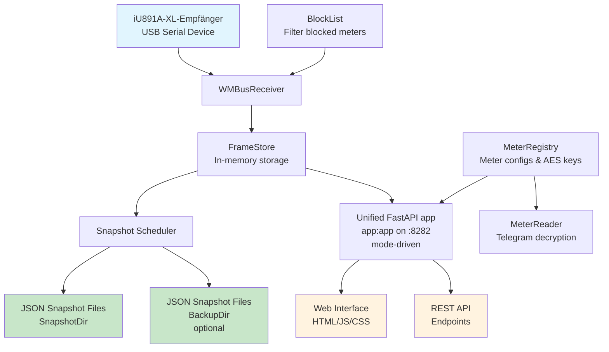

```mermaid
graph TD
    A[iU891A-XL-Empfänger<br/>USB Serial Device] --> B[WMBusReceiver]
    C[BlockList<br/>Filter blocked meters] --> B
    B --> D[FrameStore<br/>In-memory storage]
    D --> E[Snapshot Scheduler]
    E --> F[JSON Snapshot Files<br/>SnapshotDir<br/>]
    E --> G[JSON Snapshot Files<br/>BackupDir<br/>optional]
    
    D --> H[Unified FastAPI app<br/>app:app on :8282<br/>mode-driven]
    H --> I[Web Interface<br/>HTML/JS/CSS]
    H --> J[REST API<br/>Endpoints]
    
    K[MeterRegistry<br/>Meter configs & AES keys] --> H
    K --> L[MeterReader<br/>Telegram decryption]
    
    style A fill:#e1f5fe
    style F fill:#c8e6c9
    style G fill:#c8e6c9
    style I fill:#fff3e0
    style J fill:#fff3e0
```